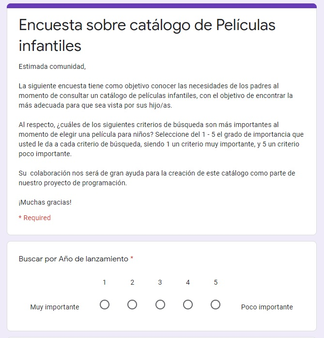
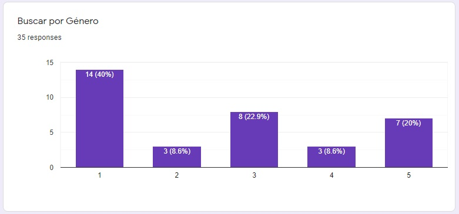
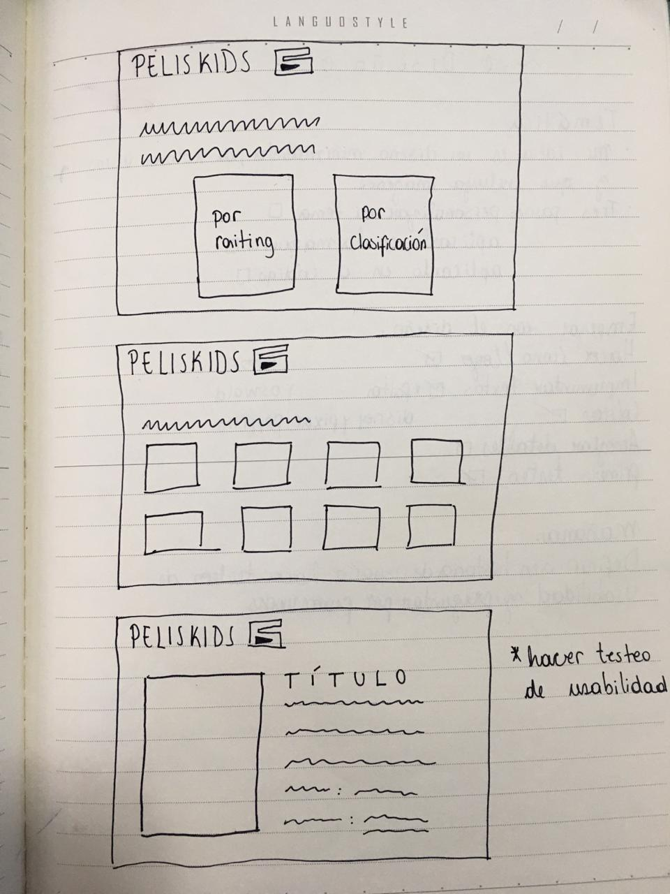
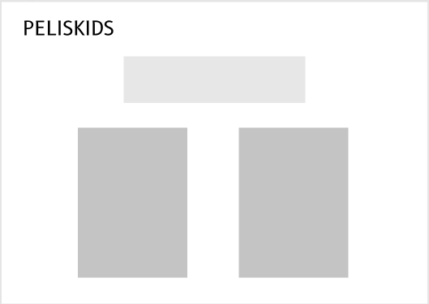
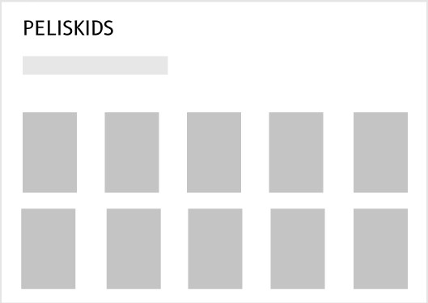
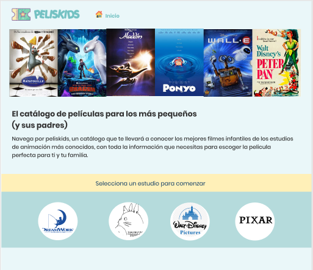
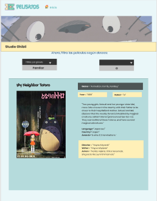
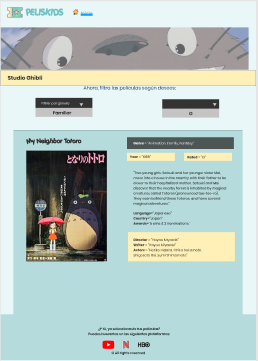

# PelisKids

"Peliskids" es un catálogo de películas infantiles para padres que buscan una película junto con sus hijos.

[Enlace Deploy Peliskids](https://katsmunoz.github.io/PelisKids/src/index.html)

## Funcionalidad

El sitio web "PelisKids" fue implementada utilizando las tecnologías: HTML5, CSS3, JS ECMA6 y Bootstrap.
Esta aplicación le permite al usuario objetivo realizar una búsqueda rápida y eficaz de las mejores películas infantiles por estudio de animación, además puede filtrar por género y clasificación. Finalmente, se ofrece una ficha técnica de la película seleccionada, en donde aparece: el nombre, género, año, clasificación, sinopsis, duración y reparto.

## Introducción de la aplicación

Este sitio web es de **carácter informativo**, ya que se presenta como un catálogo de búsqueda de las mejores películas infantiles de cada estudio de animación. Le permite a un padre o madre buscar en forma guiada, es decir, puede seleccionar utilizando unos de los criterios de búsqueda más significativos para un ente paternal, como lo es el género y la clasificación.

# Definición del producto

## Hipótesis:

Para muchos padres y madres, ver películas con sus hijos constituye un excelente panorama familiar, y habitualmente, esta elección se realiza en conjunto con los niños, por lo que resultaría muy útil contar con un catálogo online para buscar filmes infantiles.

## Escenario:

Un padre o madre aficionado al cine necesita una forma rápida y eficaz de buscar una película, ya que su hija o hijo está impaciente por ver una. El adulto quiere hacer la búsqueda en conjunto, para así elegir un filme que satisfaga a ambos, es decir, que sea de un género en específico y que sea apta según la edad de su hijo o hija.

## Principales usuarios:

Madres o padres cinéfilos y no cinéfilos, que sean nativos digitales y que necesiten realizar la búsqueda de una película infantil.

## Objetivo principal:

Posicionar a nuestro sitio web como una de las principales plataformas informativas para la búsqueda de películas infantiles.

## Investigación
El acto de ver películas en familia en casa es beneficioso porque se crea un momento para disfrutar, además se puede aprovechar para hablar con los hijos de su interés por otras culturas e ideologías, y de paso, alimentar esa curiosidad propia de la edad.

Con el fin de conocer los criterios de búsqueda de películas más importantes para los padres y madres, se realizó una encuesta mediante el envío de un formulario a través de la red social Facebook. La encuesta se posteó en grupos de cinéfilos y padres, como [Cine Club Normandie](https://www.facebook.com/groups/190263331771360/), [Seriéfilos y Cinéfilos UC](https://www.facebook.com/groups/1596991810514535/Básicamente) y [Mapau](https://www.facebook.com/MAPAUUCHILE/). Además, también se compartió con conocidos que cumplieran con los criterios de ser padres y aficionados a ver películas. En la encuesta, los padres debían seleccionar el grado de importancia que le daban a cada filtro de búsqueda, los que consistían en Año, Director, Actores, Género, Clasificación y Rating.

[Ver Encuesta completa aquí](https://docs.google.com/forms/d/e/1FAIpQLSep5gULwm0AsVjf9tG-Z00g4JvCPtiecwV3yrw7ihx2ddbCpQ/viewform)

Después de poco más de 24 horas, obtuvimos los primeros resultados, obtuviendo 35 respuestas en total.

El principal hallazgo fue que los padres y madres consideran relevantes los criterios de búsqueda por género y clasificación, es decir, les interesa conocer la temática y la edad apta para ver la película.

A partir de esta pequeña research, fue posible definir los contenidos del sitio web y enfocarnos lo que queremos lograr con nuestra aplicación, que es invitar a la familia a reunirse para elegir películas en base a un catálogo informativo.

## Historias de usuario

Se redactaron las historias de usuario según los hallazgos de la investigación. Para planificar el desarrollo del código, se utilizó la herramienta de [Trello](https://trello.com/), donde incluímos nuestros objetivos, decisiones a tomar y las cosas que faltaban por hacer.

Después de decidir los objetivos de nuestra página junto a los requerimientos del usuario, pudimos comenzar a redactar nuestra historia de usuario principal.

**Yo,** como madre y/o padre de niños pequeños y aficionada/o a ver películas, **quiero** saber sobre películas de buenos estudios que sean adecuadas para ver con mis hijos, **para** conocer cuáles son las mejores películas infantiles.

[Ver Trello PelisKids aquí](https://trello.com/b/T7W4bTvQ/movie-data-base)

## Objetivos del usuario en relación al producto

- El usuario podrá navegar en un catálogo que contiene las mejores películas infantiles de cada estudios de animación (Disney, Pixar, Dreamworks y Ghibli).
- El usuario satisfacerá su necesidad de filtrar películas infantiles según el criterio de búsqueda por género y clasificación.
- El usuario podrá acceder a información relevante sobre cada película contenida en una ficha técnica.

# Nivel de experiencia y de interfaz
Lo primero fue identificar los aspectos relevantes para los usuarios, es decir, aquella información que les gustaría ver en la app. Luego, se distribuyó esa contenido en diversas secciones, de tal forma, que hubiese una coherencia en la experiencia del viaje. Para concretar esas ideas se páso a la siguiente fase:

## Etapas del prototipado

a) Prototipos de baja fidelidad (wireframes) 

- **Sketch a mano alzada:**
Fue el primer acercamiento a la ideal producto.

- **Figma:**
El sketch de lápiz y papel fue llevado a Figma, en donde de, forma simple y muy rápida se logró un diseño estático más cercano, en blanco y negro y que mostraba el orden y estructura de los contenidos. 

[Ver prototipo de baja fidelidad completo aquí](https://www.figma.com/proto/xdtyhzV74F3XvCtnPyTeCI/Peliskids---baja-fidelidad?node-id=1%3A2&scaling=min-zoom)

a) Prototipos de alta fidelidad (mockup)

Para desarrollar nuestro mockup de alta fidelidad, volvimos a utilizar [Figma](https://www.figma.com/), para así integrar los colores y formas que fuesen más fiel a nuestro diseño final.

[Ver prototipo de Alta fidelidad completo aquí](https://www.figma.com/file/g3hMcmrAixW9CEnMHXdDqF/Peliskids---alta-fidelidad?node-id=0%3A2)

# Iteración con usuarios

## Video de Testeo 1 

https://www.loom.com/share/cefea915f14a4fe1bbc704f89c8f43f7

## Video de Testeo 2 

https://www.loom.com/share/7c5fea5c6aa64c89939c7b4b89d9572e

Llevamos a cabo 3 testeos de prototipado, con usuarios que cumplieran los requisitos (padres o madres, que disfruten ver películas).

Nota: el tercer testeo fue hecho con celular, pero se integrará una vez que se suba a loom.

## Test de usabilidad

Luego de la aplicación de los test de usabilidad, se pudo identificar los siguientes comentarios/problemas:

1. Los íconos que teníamos al principio de cada estudio de animación, no se lograban entender del todo.

2. Quedó la duda de si los filtros eran dependientes entre sí, es decir, que se tuvieran que marcar los dos para funcionar.

3. El usuario no identificó la opción de volver a la página de inicio através del logo.

4. Los usuarios pensaron que la imagen del header no era alusiva a el sentido de la página.

5. Los usuarios se mostraban interesados por el contenido de la página, y pensaban en sus hijos/parientes, con los cuales verían las películas.

6. Un usuario mencionó que es muy parecido a los catálogos de los aviones para seleccionar películas, así que le gustaba la idea con esta temática.

### Resumen de Feedback de usuarios 

Según nuestro primer testeo con usuario, los íconos que teníamos al principio de cada estudio de animación no se lograban entender del todo, ya que no tenían los nombres de éstos (no era representativo). Surgió la primera iteración a partir de esto, donde cambiamos los íconos por las fotos oficiales de cada estudio. También surgió la duda de si los filtros eran dependientes entre sí, es decir, que se tuvieran que ejecutar los dos para funcionar, por lo que iteramos la posición y agregamos un texto explicativo a esa parte.

En nuestro segundo testeo, el usuario no identificó la opción de volver a la página de inicio através del logo, por lo que implementamos un botón de inicio. El usuario, además, esperaba un tráiler, por lo que pudimos analizar que no se entendía bien el objetivo de la página, el cual es informativo, por lo que iteramos los textos explicativos del inicio.

En nuestro tercer y cuarto testeo, los usuarios pensaron que la imagen del header no era alusiva al sentido de la página, por lo que decidimos crear el carrusel con distintas fotos de películas de los estudios de nuestro sitio. Además, notamos que los usuarios sólo se fijaban en la sinopsis y género de la información, por lo que acotamos la ficha para que no fuera confuso al momento de leer. 

# Diseño de interfaz:

A continuación, se irán describiendo los aspectos de diseño visual respecto del futuro producto digital (basado en las iteraciones con usuarios).

- **Proximidad:** 
Los elementos que comparten relación estan próximos entre sí. Se proporciona una coherencia entre los diferentes contenidos. Hubo un desarrollo minucioso de cada elemento del sitio, de forma que quedaran cercanos todos los elementos alusivos entre sí y se entendiera el flujo de la página. 

- **Repetición:** 
El contenido más importante como: logo y botón de inicio, header y contenido, botones/select, información de la ficha comparten jerarquía. Por lo que se observa una consistencia visual externa.

- **Alineación:** 
Existe alineación izquierda del contenido y, solo cuando es requerido, los textos se centran (instrucciones).

- **Contraste:** 
El uso del contraste no interfiere en la legibilidad del sitio web. Gracias a nuestras iteraciones y decisiones como equipo, logramos una visualización correcta de cada texto en PelisKids. Utilizamos colores claros como azul y naranjo pastel, e implementamos los textos en negrita para facilitar la lectura (en fondos negros, la letra es blanca). Se observa una armonía en el contraste a nivel general.

- **Tipografía:** 
La tipografía usada es, primero, en el logo, un poco más interactiva para darle autenticidad a nuestra página. En el resto del contenido se utilizó una letra de tipo sans serif para mantener el orden y la armonía en la pagina.

- **Color:** 
Se eligió, principalmente, el color azul, puesto que éste color provoca simpatía, amistad, confianza y fidelidad en los observadores, lo cual va directamente relacionado con el sentido de nuestro sitio: un ambiente familiar, que provoque confianza en el usuario y sienta la libertad de buscar las películas infantiles que desee. Combinamos este color junto con el naranja pastel, pues, además de ser parte del ticket del logo, provoca energía y felicidad, característico de los niños. 

## Trabajo en Equipo

Nuestro equipo lo conforman:

- Catalina Alzamora: Front End
- Katherine Muñoz: Front End
- Paulette Órdenes: UX
- Bianca Vicencio: Front End

Las decisiones de diseño y prototipado fueron tomadas en conjunto, siendo Paulette quien trabajó en pasarlo a prototipados para testeos utilizando Figma. 

El desarrollo front end de nuestro proyecto fue trabajo colaborativo, muchas veces trabajando en un mismo pc para corroborar código e integrar cambios. Utilizamos estrategias de code review y pair-programming, compartiendo conocimientos constantemente, en especial todo lo que se refiere al uso de git, bootstrap y procesos de interfaz del usuario.

Las iteraciones del prototipado fueron llevadas a cabo por las 4, participando del proceso de entrevista y registro de feedback.
